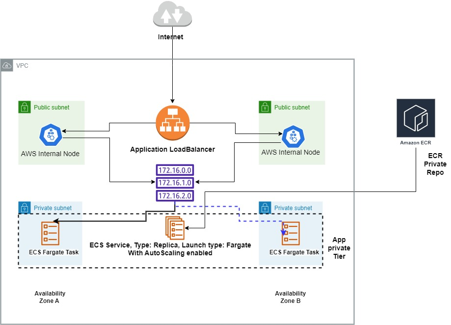
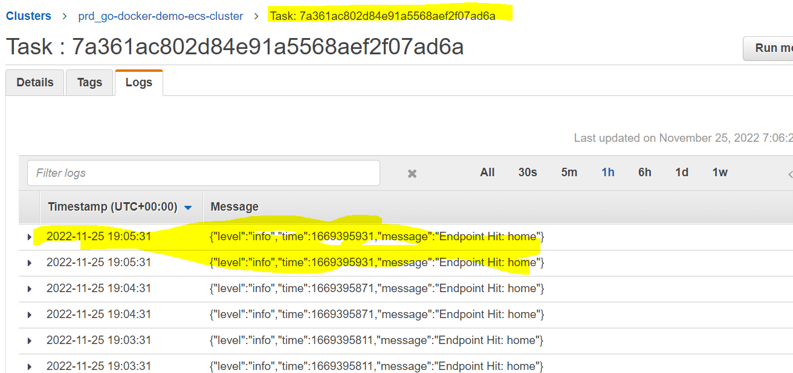

# Containrized go-docker-demo app.
## About

- This doc is to guide how to implement sample containrized go-docker-demo app locally and on AWS ECS service and also how to deploy new version using DevOps CICD automated pipeline.

## Table of Contents

1. [Introduction](#Introduction)
2. [Testing Locally](#Testing-Locally)
3. [Design Architecture](#Design-Architecture)
4. [Design Aspects](#Design-Aspects)
5. [IAC Implementation](#IAC-Implementation)
6. [Pipeline and Deployment](#Pipeline-and-Deployment)
7. [To Do List](#ToDO)

### Introduction

- This sample app is built on go language and deployed on AWS ECS fargate service.
- AWS resources are created with IAC using terraform.
- Automated pipeline through AWS CodePipeline, CodeBuild and CodeDeploy.

### Testing Locally

- For testing app locally on machines with Docker, please run the below <ins>commands</ins>: 
```
docker build  -t goapp .
docker run --name goapp-demo -itd -p 8000:8000 goapp
```
>**Note** 
>Docker needs to e installed on machine locally, for installation tips according to your OS platform, please check this [Docker official docs](https://docs.docker.com/engine/install/).
- For hitting your go app locally, please run this on your broswer:
```
http://127.0.0.1:8000
```
### Design Architecture



### Design Aspects

- Application is deployed on public subnets with internet-facing scheme to allow the customers to access our application externally.

- Incase of the business need to allow the access of our app internally throught VPC, The IAC Code handles this throgh configuring this [attribute](https://github.com/MIna-Maher/sample-go-ecs-tf-codePipeline/blob/b595c97dea2ce4cfb4b6697026a022f8c97d0a29/iac/go-docker-demo.tf#L50) to **true** and configure **private_subnets** instead of [public_subnets](https://github.com/MIna-Maher/sample-go-ecs-tf-codePipeline/blob/b595c97dea2ce4cfb4b6697026a022f8c97d0a29/iac/go-docker-demo.tf#L91)

> **Note**
> For more dtails about the traffic flow from internet-facing ALB and how it routes the traffic to the private intances, please refer to [AWS Official Doc](https://docs.aws.amazon.com/prescriptive-guidance/latest/load-balancer-stickiness/subnets-routing.html).

- The IAC code handles configuring the ALB listernes with SSL for securing the connection the communication by configuring this [attribute](https://github.com/MIna-Maher/sample-go-ecs-tf-codePipeline/blob/0e04eab3d080c6e0259fea5cb868cdd8fefc7336/iac/go-docker-demo.tf#L49) to **true** and also configuring the [domain](https://github.com/MIna-Maher/sample-go-ecs-tf-codePipeline/blob/0e04eab3d080c6e0259fea5cb868cdd8fefc7336/iac/go-docker-demo.tf#L53) name of choosen ACM certificate.

- Go App is deployed using AWS ECS Fargate, Fargate is a serverless compute engine for containers that abstracts the underlying infrastructure and can be used to launch and run containers without having to provision or manage EC2 instances. Users don’t need to worry about instances or servers, they need to define resource requirements.

- App tasks are deployed on private subnets "App Private Tier" and accept connection only from ALB SG for securing our app.

- ECS Service is created with desired **1** task with cpu: 256 && RAM: 512 , and enable service autoscaling for autoscaling the number of tasks incase of increasing the load.
- Service AutoScaling: 

- For configring scaling average tracking metrics for cpu/ram, number of desired/max tasks, please configure these params according to your need, this configs can be found on [go-docker-demo.tf](./iac/go-docker-demo.tf) and also for the pipeline [task def](./pipeLineScripts/postBuild.sh):

 <ins>**go-docker-demo.tf**</ins>:

```
  cpu                           = 256
  memory                        = 512
  task_name                     = "go-docker-demo"
  task_family                   = "go-docker-demo"
  task_network_mode             = "awsvpc"
  task_requires_compatibilities = "FARGATE"
  cluster_name                  = module.ecsCluster.oEcsClusterName
  cluster_id                    = module.ecsCluster.oEcsClusterId
  desired_tasks                 = 1
  max_capacity                  = 2
  ecs_service_ram_target_value  = 80
  ecs_service_cpu_target_value  = 80
```
 <ins>**taskdef**</ins>:
```sh
  export taskCPU=256
  export taskRAM=512
  export aws_logs_group=${env}-go-docker-demo-log-group
```

> **Note**
> For configuring fargate cpu/ram for your task, please refer to [AWS Doc](https://docs.aws.amazon.com/AmazonECS/latest/developerguide/AWS_Fargate.html).

- For monitoring app logs and metrics, It's used awslogs log driver to send all app logs to cloudwatch, also enable AWS ECS containerInights for sending all tasks/cluster metrics to cloudwatch.

- The awslogs logdriver is added to task def file and can be configured from this [file](./pipeLineScripts/postBuild.sh). Also For **cost saving** , the created cloudwatch log group has setting of log_group_retention_in_days to **30** days and can be configured from this [file](https://github.com/MIna-Maher/sample-go-ecs-tf-codePipeline/blob/4cf1bfed0029fa676d3ad39fc7c601ffb3dd8e4b/iac/prd-us-east-1.tfvars#L7).

- Logging: 
- For enabling **container_insights** , this can be configured from this [param](https://github.com/MIna-Maher/sample-go-ecs-tf-codePipeline/blob/4cf1bfed0029fa676d3ad39fc7c601ffb3dd8e4b/iac/prd-us-east-1.tfvars#L8)
- Metric Insights: 

### IAC Implementation

- As mentioned above all resources are created using terraform. all IAC can be found on this [directory](./iac/).

- Terraform code contains different [modules](./iac/modules/) to create the needed resources and calling them through [go-docker-demo.tf](./iac/go-docker-demo.tf) main file and passing some common variables through [prd-us-east-1.tfvars](./iac/prd-us-east-1.tfvars).

- <ins>**Note**</ins>: **prd-us-east-1.tfvars** is just naming convention to make it it easy to have differnet values when having multiple envs and regions, However you could name it anyname like xxxxxx.tfvars.

- IAC Modules are: 
- [<ins>**networking**</ins>](./iac/modules/networking/): For Creating and configuring vpc, private subnets and public subnets.
- [<ins>**ecsCluster**</ins>](./iac/modules/ecsCluster/): For Creating and configuring the ecs cluster.
- [<ins>**ecrRepUIService**</ins>](./iac/modules/ecrRepo/): For Creating and configuring ecr private registery.
- [<ins>**albUIService**</ins>](./iac/modules/loadBalancer/): For creating and configuring ALB.
- [<ins>**ecsService**</ins>](./iac/modules/ecsService/): For creating and configuring ECS Fargate service.
- [<ins>**go-app-codedeploy**</ins>](./iac/modules/codedeploy/): For creating and configuring codeDeploy app and deployment group used for deployment "Discussed below".
- [<ins>**codepipeline**</ins>](./iac/modules/pipeline-deploy-module/): For creating and configuring AWS managed codepipeline , codeBuild and pipeline stages used for deployment "Discussed below".

- Using terraform s3 backend with dynamodb table to save the tfstate file and lock the state deployment during deploy resources which prevent 2 concurrent deployment on the same time, For more information about on s3 backend, please refer to [Terraform Doc](https://developer.hashicorp.com/terraform/language/settings/backends/s3).  

- IAC Uses s3 [backend.tf](./iac/backend.tf) configs to save the state file on s3 bucket, This bucket needs to be created prior to this IAC Code, it could be manually, AWSCLI, Console or another tf module. Here I'm using AWSCLI to create s3 bucket , configure its encryption at rest and deny all public access throguh these <ins>**commands**</ins>:
```sh
aws s3api create-bucket --bucket prd-s3-bakend-demo4 --region us-east-1
aws s3api put-bucket-encryption --bucket prd-s3-bakend-demo4 --region us-east-1 --server-side-encryption-configuration "{\"Rules\": [{\"ApplyServerSideEncryptionByDefault\": {\"SSEAlgorithm\": \"AES256\"}}]}"
aws s3api put-public-access-block --bucket prd-s3-bakend-demo4 --public-access-block-configuration "BlockPublicAcls=true,IgnorePublicAcls=true,BlockPublicPolicy=true,RestrictPublicBuckets=true" --region us-east-1
```
- **Notes on S3**:

- `bucket` - s3 bucket name, has to be globally unique.
- `key` - Set some meaningful names for different services and applications, such as vpc.tfstate, application_name.tfstate, etc
- `dynamodb_table` - optional when you want to enable [State Locking](https://www.terraform.io/docs/state/locking.html)

> **Note**
> The IAC creates codepipeline which connects to Github Repo for pulling source code and configuring webhook to auto trigger the pipeline using `Personal Access Token` and for security practices this PAT cannot be saved on source code, Its created as secure string SSM parameter named `GitHubToken`, So you need to create this ssm parameter manually with your own PAT before running the IAC otherwise it will fail.
You can check this configuration on [go-docker-demo.tf](./iac/go-docker-demo.tf)
```tf
data "aws_ssm_parameter" "GitHubToken" {
  name            = "GitHubToken"
  with_decryption = "true"
  #####Default for with_decryption is true
}
```


- For init/plan/deploy IAC Resources, please run the below <ins>**commands**</ins>:

```sh
cd iac/
terraform init
terraform plan -var-file=prd-us-east-1.tfvars
terraform apply -var-file=prd-us-east-1.tfvars
```

### Pipeline and Deployment

- The Pipeline for deploying app versions uses AWS managed services like `AWS CodePipeline` , `AWS CodeBUild` and `AWS CodeDeploy`. using managed services has benefits like no more need to manage the underlying resources to run the non managed services.

- **Notes on pipeline services**:

- `CodePipeline` - To connect with GitHub Repo and creates our pipeline stages and actions needed to build/deploy.

- `codeBuild` - To containerize our app with the new changes, push the new image to ECR and prepare the needed output artifacts to the deploy stage.

- `codeDeploy` - To Deploy the app new image version "new task def revision" to new with task following B/G - Canary or ECSAllAtOnce according to the business need.

- Pipeline Architecture: 

> **Notes CodePipeline**
#### Code pipeline stages:
- `Source` - To connects to github repo for pulling source code using *GitHub PAT* and exporting the code artifacts to s3 bucket.
- `build` - using codebuild project to containerize our app with the new changes, push the new image to ECR and prepare the needed output artifacts to the deploy stage.
- `deploy` - Amazon ECS BLue/Green deploy with codeDeploy.
- IAC_code for pipeline and the stages can be found on this [file](./iac/modules/pipeline-deploy-module/main.tf).
> **Note**
> For automating the pipeline to auto trigger in case of push events to github, the IAC creates and configures GitHub webhook using PAT, This can be found [here](https://github.com/MIna-Maher/sample-go-ecs-tf-codePipeline/blob/fab1a8adf24f11ad0b833fcf385213244417d55f/iac/modules/pipeline-deploy-module/main.tf#L97).

> **Notes On codebuild**
- CodeBuild project after pushing the image to ECR it prepares the output artifacts needed for deploy stage like the below on [buildspec.yaml](./pipeLineScripts/buildspec-lint.yml) file:
```yaml
artifacts:
  files: 
    - imageDetail.json
    - taskdef.json
    - appspec.yml
```
> **Notes On codeDeploy**
- codeDeploy uses [appspec.yml](./pipeLineScripts/appspec.yml) file and the output artifacts from the previous stage to create new task with the new task revision on the **ALB green target group** "as shown on above pipeline arch ".
- At some points there are 2 running versions of the app and 2 URLs, the current one for serving the customers normally and the seconds one is for QA team and deveoppers to check the changes before rolling to the current customer facing app version.
- Through the IAC code you have the control to choose which **deploymnt strategy** you want to apply according to the <ins>**Business Need**</ins> by configuring the below configs on this [go-docker-demo.tf](./iac/go-docker-demo.tf) file.

```tf
  termination_wait_time_in_minutes = "0"
  time_interval_in_minutes         = "1"
  percentage_canary_deployment     = "10"
  deployment_config_option         = "canary"
  #deployment_config_option        = "AllAtOnce"
```
- For Example on the above configs, the deploy strategy is `canary` so the trafic is shifted with `10%` for `1 minute` to the new task then the remaing. After the shifting is done completely the old task will be terminated immediately as `termination_wait_time_in_minutes = 0`
- For More detailed info on deploying on ecs with code deploy, please refer to [AWS Doc](https://docs.aws.amazon.com/codepipeline/latest/userguide/tutorials-ecs-ecr-codedeploy.html)

- Deploy Example: 

### To Do List:

- [x] IAC Implementation
- [x] Code Pipeline Implementation
- [ ] Onboarding database on private data tier.
- [ ] Handling db credentials from secret manager.
- [ ] Adding more microservices and making use of ECS service discovery for connecting apps.

- New Release Design and Notes: 
- Notes: The database will be on private data subnets and allow connections only from app SG.


